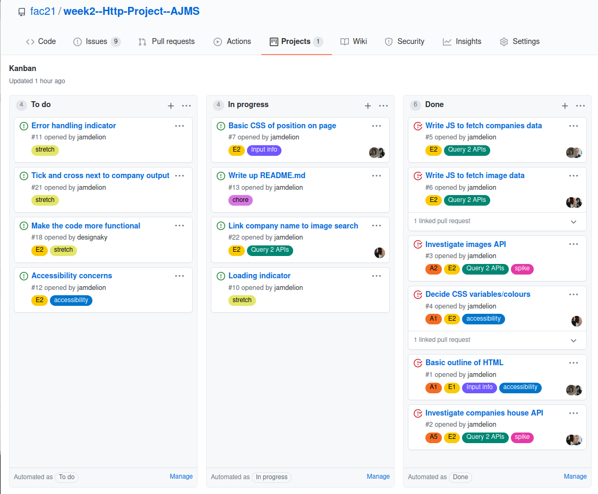

# Week 2 Project: HTTP, fetch() and APIs

## Team :brain:
- [Sevda](https://github.com/sevdas) - Deployment
- [Jo](https://github.com/jamdelion) - Facilitator
- [Mariya](https://github.com/MariyaPeychinova) - Code Quality
- [Antonio](https://github.com/designaky) - User Specialist

## Project requirements: ✔️	

- Query at least two APIs using fetch
- Dynamic content generated with JS
- View the app on all devices
- The app is accessible to as many different users as possible.

See [week 2's schedule](https://learn.foundersandcoders.com/course/syllabus/http/project/) for more detailed information on the project and project requirements.

---

## APIs used 🖥️

- [Companies House API](https://www.api.gov.uk/ch/companies-house/#companies-house)
- [Pexels image/video API](https://www.pexels.com/api/documentation/)

## Idea 🌟

Our website is ideal for potential entrepreneurs who would like to start thinking about the name and image of their new brand. 

Based on the user's query name, the site checks the Company House API to see if a company with that name exists. If the name is available, the image API is queried to suggest a possible logo. 

## Initial Design 🎨

We designed the site using Figma:

**Desktop**

**Mobile**

## Stretch Goals 🥅

- 404 error handler
- Loading indicator
- Automatic suggestions for other company names

## Planning 📝

We used Github's automated Kanban board with custom issue labels to keep track of which tasks belonged to which user stories:

